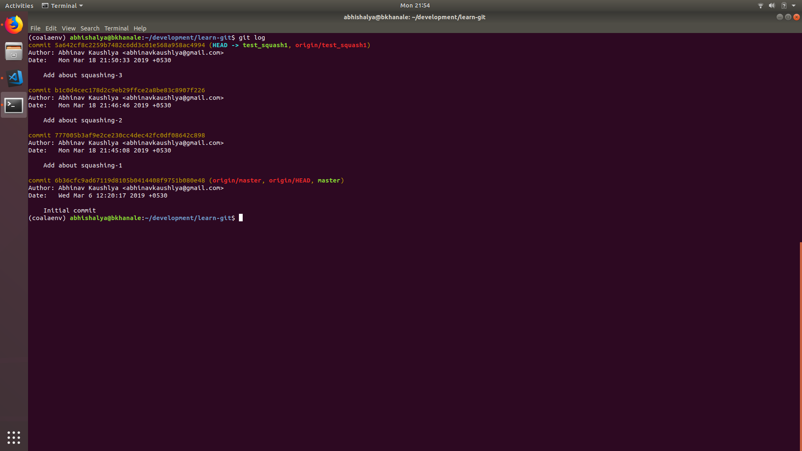

## Squashing commits

One of the most used features of git. It is absolutely important to learn this
nicely so that you don't mess up the branch. Trust me, I have seem people
completely messing up so that it becomes so confusing that it becomes beyond
recoverable. :laugh:

But no worries, I'm here to rescue you. As as example you could either fork this
repo, or create your own playground repo. It would be something that you can use
to try this one out.

First, switch to a new branch in your fork. I really hope you'd know this, since
there is no point for you to learn this first if you haven't leart that yet.
I'm not having basic tutorials on git, I will, in some time.

So, go ahead, creatre a new branch by:

```sh
git checkout -b new_branch
```

Then you could add yourselves some commits to squash. Do some random changes to
README.md file or create any new file you like. There should be some change
between every new commit you crete. I'm here creating three commits with some
changes to my README.md file. So at the end I have three commits as follows:

* Commit-1: Add about squashing-1
* Commit-2: Add about squashing-2
* Commit-3: Add about squashing-3

Now, I want them to be squashed them into one. I think most of the times you
would be in a state where you are having multiple commits representing same
change. It is important in such case that you squash them into a single commit
so as to maintain clean git log.

You are free to push these changes to your fork and create a PR to be more
assured that you are doing the correct thing. But, it is not necessary for all.

Lets do a git log first, and see what is the output. Here I'm attaching
screen-shots since I think they just look more assuring.


