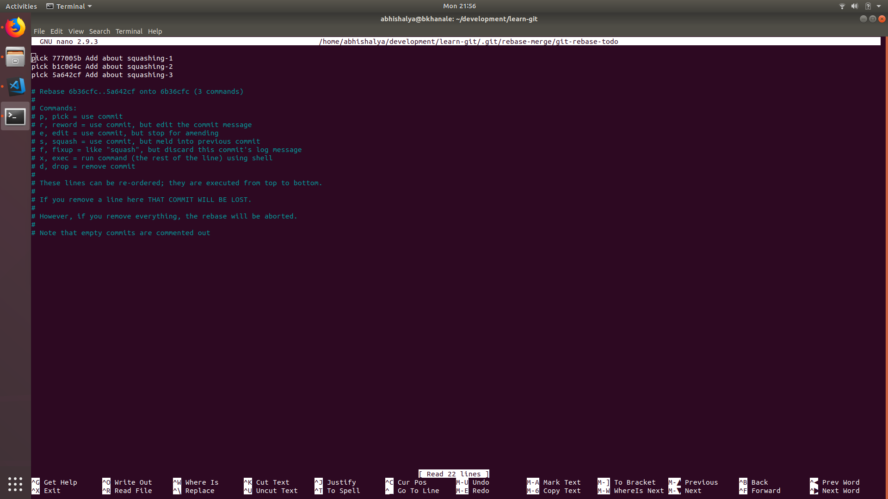

## Squashing commits

One of the most used features of git. It is absolutely important to learn this
nicely so that you don't mess up the branch. Trust me, I have seem people
completely messing up so that it becomes so confusing that it is beyond
recoverable. :laugh:

But no worries, I'm here to rescue you. As as example you could either fork this
repo, or create your own playground repo. It would be something that you can use
to try this one out.

First, switch to a new branch in your fork. I really hope you'd know this, since
there is no point for you to learn this first if you haven't learned that yet.
I'm not having basic tutorials on git, I will probably, in some time.

So, go ahead, create a new branch by:

```sh
git checkout -b new_branch
```

Then you could add yourselves some commits to squash. Do some random changes to
README.md file or create any new file you like. There should be some change
between every new commit you create. I'm here creating three commits with some
changes to my README.md file. So at the end I have three commits as follows:

- Commit-1: Add about squashing-1
- Commit-2: Add about squashing-2
- Commit-3: Add about squashing-3

Now, I want them to be squashed them into one. I think most of the times you
would be in a state where you are having multiple commits representing same
change. It is important in such case that you squash them into a single commit
so as to maintain clean git log.

You are free to push these changes to your fork and create a PR to be more
assured that you are doing the correct thing. But, it is not necessary for all.

Lets do a git log first, and see what is the output. Here I'm attaching
screen-shots since I think they just look more assuring.


As you can see I have total 4 commits which contains the three I just created.
`git log` is very important, you should check at every step what exactly is
happening. Now you can push, or wait until you realize that these three commits
represent same change and there is no need of creating three commits instead we
could have just one which would carry the changes of all three commits.

So, in order to do that, just do:

```sh
git rebase -i HEAD~3
```

Here it is important to note that the number `3` represents the number of
commits you want to join together. Since here we need to join 3 commits, I need
to specify the range `HEAD~3` in the command.

After running the above command, one of your favorite text-editors will pop-up
as below:



Now, you will see the commits in the reverse order. Its simple from now on.
Just change the commits which you want to squash from `pick` to `squash` or `s`.
I preferred the smaller name, and used `s`. This will squash the commits with
`s` into the above one. After changes it should look something like this:


Now, just save and exit from your text-editor and the editor would pop-up again.
This one is to create the new commit. Initially it would have commit messages
and comments (for your understanding) into the new commit. But you can change
that as you like. I have followed basic commit guidelines and here is my final
commit:


Now, its time to again save and exit of your text-editor. Do a simple `git log`
and make sure that there is just one commit now in place of three
(as seen before). The output of `git-log` should be something like this:


Now, its done :tada:. You have successfully squashed three commits into one.
Similarly you can squash any number of commits into one. You can now push
the commit to your branch and see it on web!

This was my first article on squashing commits. I have written it very fastly,
so there may be some grammatical/spelling errors. But I hope you understood it.
If you find any issues feel free to create issues, or make a PR and I will be
happy to merge them. :smile:

In case of any doubts contact me on abhinavkaushlya@gmail.com
